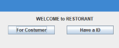
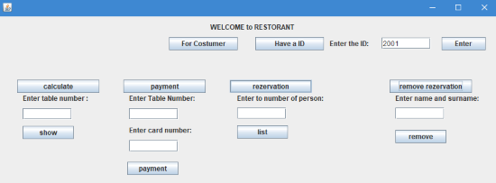
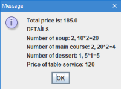
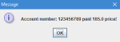
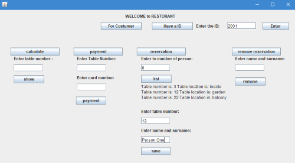

# Restaurant_Reservation_System
Swing kütüphanesi kullanılarak hazırlanmış kişi adına rezervasyon yapma, rezervasyon iptali, ödeme ve masa numarasına göre hesap çıkaran uygulamaları barındıran GUI projesidir.

Gerekli işlemlerin yapılabilmesi için ID girilmelidir.

Siparişin alındığı varsayılarak, sipariş içeriği ve toplam tutarı 'calculate' özelliği ile hesaplanmıştır.

Verilen numaraya göre ödeme işlemi 'payment' özelliği ile yapılmıştır.

Rezarvasyon yapılabilecek uygun masa ve konumları 'reservation'özelliğinde gösterilmiştir.

